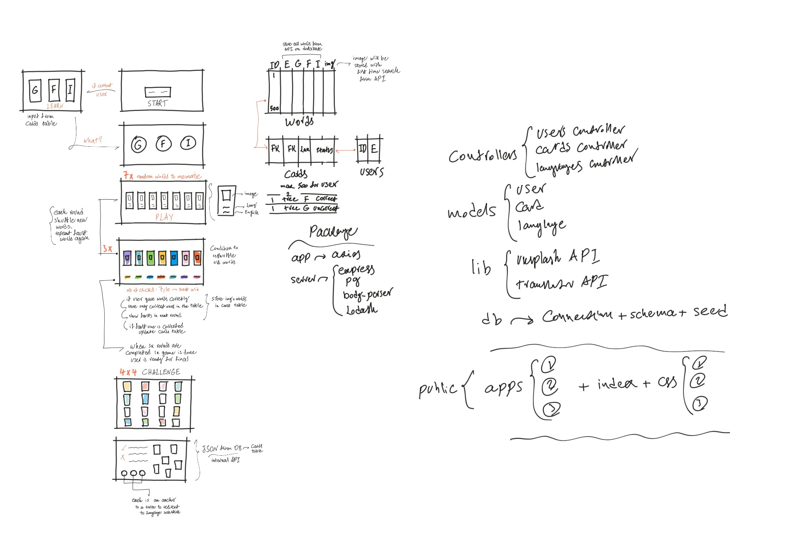

# Flash Zoo Client Application

Flash Zoo is a client application to learn 500 animal names by using flashcards. The user can learn in three different languages: German, French and Italian.

At first we hap planned on doing a flashcard application to learn the 500 most used words in different languages. We quickly realised that too many flashcards wouldn't have a photo to display because too many words cannot be represented by a photo (ie: the, that, this, etc...) so we decided instead to choose a theme and that's how Flash Zoo was born.

## Wireframe:

To remove as much friction as possible we decided to not use passwords for the game. The user would only need to enter an email address and if it did not exist in our database we would then add it otherwise just fetch previous records.

The following step is to choose which language you would like to learn.

Then the user would be presented with 7 cards with a photo and the animal name in English and the language chosen in the previous screen. The player would try to memorise the names and then press play.

The following screen the user will see the 7 cards with only the photo and the animal names in the bottom of the screen in random order. Each name has a color. The user has to match the names with the right photo. When it's a match the card will have borders added to it with the color of the matching name, if it's not a match then the user needs to keep trying to find the right card with a maximum of 10 attempts.

Once finished the user is shown a summary screen displaying the score and the cards learnt.

## Technologies used:

- JavaScript
- HTML
- CSS
- Lodash
- Axios

## Challenges:
